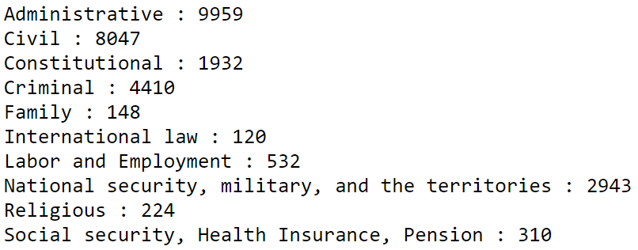
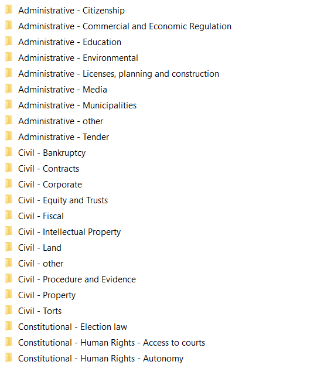

# Hebrew Court Analyzer - Machine Learning - Introduction

---

<br>

This project is the machine learning related part of the entire [Hebrew Court Analyzer](https://github.com/Immanuelbh/HebrewCourtVerdictsAnalyzer) two-semesterial project. 

I have done this project alongside [Immanuel Ben Hefer](https://github.com/Immanuelbh).

The project instructor is [Jonathan Schler](https://www.hit.ac.il/faculty_staff/%D7%99%D7%94%D7%95%D7%A0%D7%AA%D7%9F_%D7%A9%D7%9C%D7%A8).

We scrape, parse, enrich verdicts from the [Hebrew Supreme Court Website](https://supreme.court.gov.il/Pages/HomePage.aspx).

We use an ELK environment for indexing and visualizing the results.

<br>

---

<br>

I have used machine learning methodologies for two main parts:

<br>

<br>

1. The verdict category ___classifier___
<br>    
    There are multiple verdict categories and sub categories.
<br><br>
    I have used tagged data to sort the verdicts by Categories.
<br><br>
    The sorted verdicts had been tokenized by a [Tfidf Vectorizer](https://scikit-learn.org/stable/modules/generated/sklearn.feature_extraction.text.TfidfVectorizer.html) and used as an input for a [Multinomial Naive Bayes](https://scikit-learn.org/stable/modules/generated/sklearn.naive_bayes.MultinomialNB.html) model.   
<br>
    The classification process explained in the [Classification](#classification) section. 

<br>

<br>

2. The legal personal names ___normalization___
<br>    
    There is a variety of representations for each name in the parsed verdicts.
<br>    
    The normalization process tries to yield an injective function for all parsed input.    
<br>
    The normalization achieved by applying pre-defined deterministic steps elaborated on the [Normalization](#normalization) section below.

<br>   

---
---

# Table of contents


- [Hebrew Court Analyzer - Machine Learning - Introduction](#hebrew-court-analyzer---machine-learning---introduction)
- [Table of contents](#table-of-contents)
- [Data Acquisition](#data-acquisition)
- [Parsed json scheme](#parsed-json-scheme)
- [Classification](#classification)
	- [1. Data labeling](#1-data-labeling)
	- [2. Data Structure initialization](#2-data-structure-initialization)
	- [3. Train - Test split](#3-train---test-split)
	- [4. Vectorization](#4-vectorization)
	- [5. Training](#5-training)
	- [6. Hyper-parameterization](#6-hyper-parameterization)
	- [7. Evaluation](#7-evaluation)
	- [8. Model Dump](#8-model-dump)
- [Normalization](#normalization)
	- [1. Legal system related process](#1-legal-system-related-process)
		- [1.1. Names extraction](#11-names-extraction)
		- [1.2. Pre-process the extracted names](#12-pre-process-the-extracted-names)
		- [The pre-processing of each and every name consists of 5 major transformations:](#the-pre-processing-of-each-and-every-name-consists-of-5-major-transformations)
			- [1.2.1. __Unwanted characters elimination__](#121-unwanted-characters-elimination)
			- [1.2.2 __Common titles elimination__](#122-common-titles-elimination)
			- [1.2.3 __Common hebrew stopwords elimination__](#123-common-hebrew-stopwords-elimination)
			- [1.2.4 __Full name fix__](#124-full-name-fix)
			- [1.2.5 __Single name fix__](#125-single-name-fix)
		- [1.3 Fixing judge names](#13-fixing-judge-names)
		- [1.4 Adding the newly examined name to the _legal_dictionary data member.](#14-adding-the-newly-examined-name-to-the-_legal_dictionary-data-member)
		- [1.5 Applying normalization results to the verdict json](#15-applying-normalization-results-to-the-verdict-json)
		- [1.6 Dumping the new verdict json to the output destination](#16-dumping-the-new-verdict-json-to-the-output-destination)
		- [1.7 Dumping the new dictionary to 'legal_personal.csv' destination](#17-dumping-the-new-dictionary-to-legal_personalcsv-destination)
	- [2. Non-legal system related process](#2-non-legal-system-related-process)
- [Enrichemnt Results](#enrichemnt-results)

___
___

<br>


# Data Acquisition
The verdicts scraped from the [Hebrew Supreme Court Website](https://supreme.court.gov.il/Pages/HomePage.aspx) 

The [parser](https://github.com/Immanuelbh/HebrewCourtVerdictsAnalyzer/tree/master/hcva/parser) parses those verdicts to a specific json scheme.

The parsed verdicts are ready for enrichment.

<br>

# Parsed json scheme

The scheme looks as follows:

```json

    {
	"_index": "supreme_court_hebrew",
	"_type": "rulings",
	"_id": "1339-12-1",
	"_score": 1,
	"_source": {
		"doc": {
			"Doc Details": {
				"מספר הליך": "",
				"לפני": [
					"א' רובינשטיין",
					"י' עמית",
					"נ' סולברג"
				],
				"העותר": [

				],
				"מידע נוסף": [
					
				],
				"המשיב": [

				],
				"בשם העותר": [
					"עו\"ד יצחק גולדשטיין ועו\"ד ערן הלר"
				],
				"בשם המשיב": [
					"עו\"ד מיכל דלומי"
				],
				"סוג מסמך": "פסק-דין",
				"סיכום": "",
				"תאריך": "19/03/2012",
				"עמודים": 3
			},
			"Case Details": {}
		},
		"doc_as_upsert": true
	}
}

```
The sections we mainly focus are:
<br>

__The verdict id represented precisely as stored on the supreme court database__ - ___["_id"]___ 

__Judges__ - ___\["\_source"]\["doc"]\["Doc Details"]\["לפני"]___

__Prosecution__ - ___\["\_source"]\["doc"]\["Doc Details"]\["העותר"]___

__Defense__ - ___\["\_source"]\["doc"]\["Doc Details"]\["המשיב"]___

__Petitioner Attorneys__ - ___\["\_source"]\["doc"]\["Doc Details"]\["בשם העותר"]___

__Defense Attorneys__ - ___\["\_source"]\["doc"]\["Doc Details"]\["בשם המשיב"]___

__Verdict Summary__ - ___\["\_source"]\["doc"]\["Doc Details"]\["סיכום"]___

<br>

---
---

# Classification

## 1. Data labeling

We had a portion of tagged data which was sorted by categories and saved to a folder tree.




<br>
<br>
Those categories and sub-categories were sorted by their names and resulted on a folder tree.
<br>
<br>



<br>
<br>

---

<br>

## 2. Data Structure initialization

I have used a [pandas.DataFrame](https://pandas.pydata.org/docs/reference/api/pandas.DataFrame.html) in order to store the data.

As you may have noticed, the verdicts count vary drastically. Therefore, in order to achieve good training results for each category a balancing mechasim has needed to take place. 

That mechanism has sampled same quantity of verdicts from the chosen category and from the rest of the categories.

For example, Civil had 8047 verdicts - hence there will be two dataframes - one of 8047 civil verdict and the other of sampled 8047 out of 20,578 verdicts remained.

<br>

---

<br>

## 3. Train - Test split

I have used [train_test_split](https://scikit-learn.org/stable/modules/generated/sklearn.model_selection.train_test_split.html) in order to split the data into 70% train and 30# test.

<br>

---

<br>

## 4. Vectorization

I have used [Tfidf Vectorizer](https://scikit-learn.org/stable/modules/generated/sklearn.feature_extraction.text.TfidfVectorizer.html) in order to transform the verdict summary - a string to an array of numbers.

The vectorizer checks how many times a word is present on a sentence, divided by the whole sentence's words.

That value is further multiplied by the logarithm of the total number of sentences divided by the sentences were the current word is present

<br>


term __i__ within document __j__

w = current calculation value

The rest is plrecisely as explained above.


<br>

---

<br>

## 5. Training

The transformed data from the vectorization process is the input for the model trainning.

I use a binary classification - 1 means the verdict is from the inspected category, 0 is not of that category.

I have used a [Multinomial Naive Bayes Model](https://scikit-learn.org/stable/modules/generated/sklearn.naive_bayes.MultinomialNB.html) as the model for the classification mission.

<br>

The model calculates the priors for both of the binary classes.

That means, what is the likelihood of an object to be of which class.


For instance, when 4 sentences are present, two from each class, then the prior of either class will be an half.

<br>

Then the probabilty for each word is being calulated according to that formula:


__Important Note__: The vocabulury is of __BOTH__ classes.

Class in more specific manner is the verdict category.


<br>


The final model prediction result is the maximum between the product of all the words probabilities time the class prior.


<br>
<br>

<br>

---

<br>

## 6. Hyper-parameterization

The amount of words to take for each sentence, in a bag of words approach such as that, is called n_gram.

n_gram values from (1,1) to (10,10) had been set as the tfidf vectorizer input had been tested on the mnb model.

_official documentation:_
<br>


<br>

---

<br>

## 7. Evaluation

The results has been evalued with classification report and written to txt files.

_'Civil' results for instance:_


<br>

---

<br>

## 8. Model Dump

The best results had been picked. 

I have written an automation that picks the optimal ngram for each and every category and trains the mnb model accordingly.

The best model and tfidf vectorizer dumped using [pickle](https://docs.python.org/3/library/pickle.html)

The percedure results are two files for each category - mnb model and tfidf vectorizer.


<br>
<br>

___
___

# Normalization

<br>
The names we process are divided into two main categories:

1. Legal system related
2. Non-Legal system related

<br>

## 1. Legal system related process

### 1.1. Names extraction
    
```python

judges = verdict_json["_source"]["doc"]["Doc Details"]["לפני"]
petitioner_attorneys = verdict_json["_source"]["doc"]["Doc Details"]["בשם העותר"]
defense_attorneys = verdict_json["_source"]["doc"]["Doc Details"]["בשם המשיב"]

```

<br>

---

<br>

### 1.2. Pre-process the extracted names

<br>

### The pre-processing of each and every name consists of 5 major transformations:

<br>

#### 1.2.1. __Unwanted characters elimination__

<br>

___

<br>

Digits
    
__~~54623~~__

<br>


___

<br>

Pharenthesis content

__~~(this is removed)~~__

<br>

___

<br>

Leaked parsed statements - strings such as '2.' has leaked out from the parsing process

__~~2.~~__

<br>

___

<br>

Dash - transform

__' - '&nbsp;&nbsp;&nbsp;&nbsp;--->&nbsp;&nbsp;&nbsp;&nbsp;'-'__

<br>

___

<br>

Blankspaces - transform 

'&nbsp;&nbsp;this&nbsp;&nbsp;&nbsp;&nbsp;'&nbsp;&nbsp;&nbsp;&nbsp;--->&nbsp;&nbsp;&nbsp;&nbsp;'this'

<br>

___

<br>

#### 1.2.2 __Common titles elimination__    

Israeli security titles, legal titles, emergency services, etc.

<br>

---

<br>

#### 1.2.3 __Common hebrew stopwords elimination__

Prepositions, pronouns, verbs, conjunctions etc.

<br>

---

<br>

#### 1.2.4 __Full name fix__

Three words in length names turn into two by applying a dash between the two last names

<br>

---

<br>

#### 1.2.5 __Single name fix__

Handles single multi-dashed names and fixing them

<br>

---

<br>

### 1.3 Fixing judge names

Looking for the pre-processed name in the judges names txt file.

That process will result on 'א חיות' turns into 'אסתר חיות'

<br>

---

<br>


### 1.4 Adding the newly examined name to the _legal_dictionary data member.
<br>

---
<br>

### 1.5 Applying normalization results to the verdict json

<br>

---
<br>

### 1.6 Dumping the new verdict json to the output destination 

<br>

---
<br>

### 1.7 Dumping the new dictionary to 'legal_personal.csv' destination

<br>

That file has the name before normalization as key and after as the value

<br>

---
---

<br>
<br>

## 2. Non-legal system related process


Those names are passing through the unwanted chars elimination process only.

<br>

---
---

<br>

# Enrichemnt Results

The process verdict json before the process:

```json

    {
	"_index": "supreme_court_hebrew",
	"_type": "rulings",
	"_id": "1339-12-1",
	"_score": 1,
	"_source": {
		"doc": {
			"Doc Details": {
				"מספר הליך": "",
				"לפני": [
					"א' רובינשטיין",
					"י' עמית",
					"נ' סולברג"
				],
				"העותר": [

				],
				"מידע נוסף": [
					
				],
				"המשיב": [

				],
				"בשם העותר": [
					"עו\"ד יצחק גולדשטיין ועו\"ד ערן הלר"
				],
				"בשם המשיב": [
					"עו\"ד מיכל דלומי"
				],
				"סוג מסמך": "פסק-דין",
				"סיכום": "",
				"תאריך": "19/03/2012",
				"עמודים": 3
			},
			"Case Details": {}
		},
		"doc_as_upsert": true
	}
}

```

After:


```json

{
	"_index": "supreme_court_hebrew",
	"_type": "rulings",
	"_id": "1339-12-1",
	"_score": 1,
	"_source": {
		"doc": {
			"Doc Details": {
				"מספר הליך": "ע\"א 1339/12",
				"לפני": [
					"א' רובינשטיין",
					"י' עמית",
					"נ' סולברג"
				],
				"העותר": [
					"בנק מזרחי טפחות בע\"מ"
				],
				"מידע נוסף": [
					"ערעור על פסק דינו של בית המשפט המחוזי תל אביב בת\"א 1163/00 שניתן ביום 01.01.2012 על ידי ורדה אלשיך",
					"תאריך הישיבה:",
					"י\"ב בשבט התשע\"ד",
					"(13.01.2014)"
				],
				"המשיב": [
					"אי.סי.אם יצרני מיזוג אויר בע\"מ (בפירוק)",
					"כונס הנכסים הרשמי"
				],
				"בשם העותר": [
					"עו\"ד יצחק גולדשטיין ועו\"ד ערן הלר"
				],
				"בשם המשיב": [
					"עו\"ד מיכל דלומי"
				],
				"סוג מסמך": "פסק-דין",
				"סיכום": "",
				"תאריך": "19/03/2012",
				"עמודים": 3,
				"בשם המשיב מנורמל": [
					"מיכל דלומי"
				],
				"העותר מנורמל": [
					"בנק מזרחי טפחות בע\"מ"
				],
				"המשיב מנורמל": [
					"אי.סי.אם יצרני מיזוג אויר בע\"מ",
					"כונס הנכסים הרשמי"
				],
				"לפני מנורמל": [
					"אליקים רובינשטיין",
					"יצחק עמית",
					"נעם סולברג"
				],
				"בשם העותר מנורמל": [
					"יצחק גולדשטיין",
					"ערן הלר"
				]
			},
			"Case Details": {
				"Category": "Civil"
			}
		},
		"doc_as_upsert": true
	}
}

```

